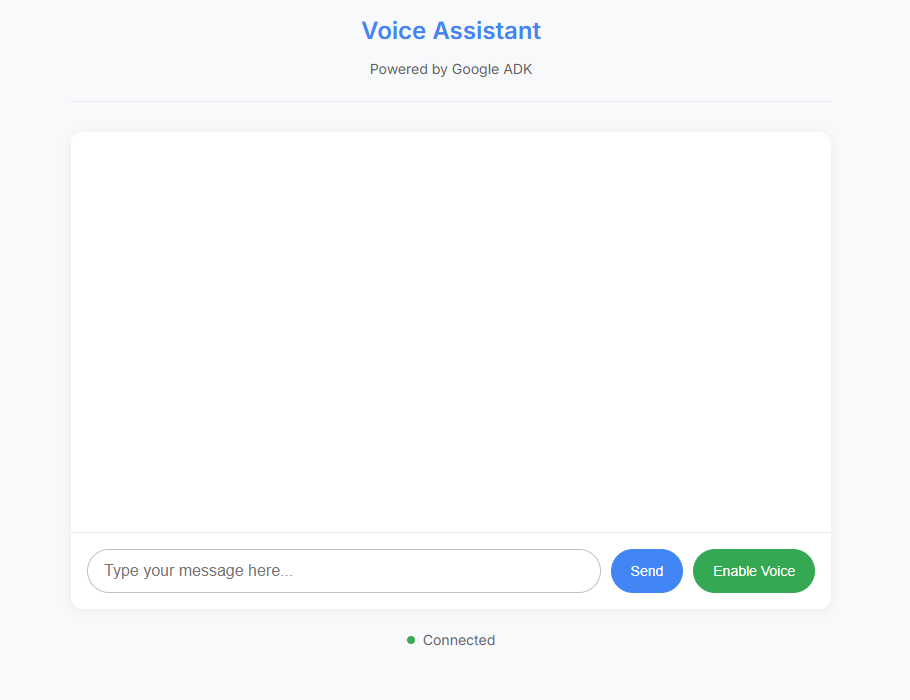
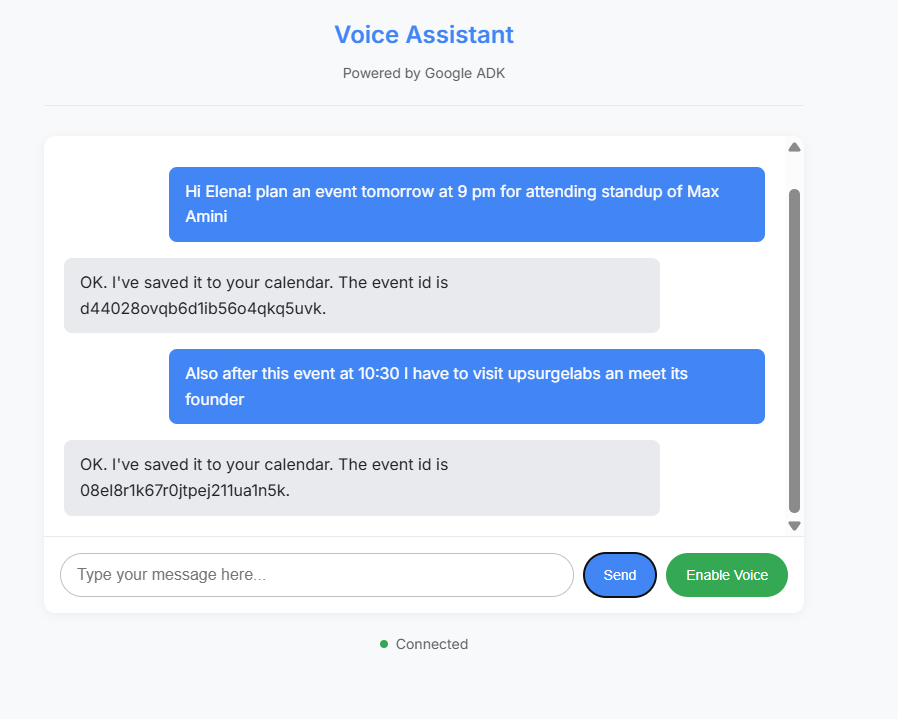

# 🗓️ Elena - AI Calendar Voice Assistant

<div align="center">



*A powerful AI-powered voice assistant for seamless Google Calendar management*

[](https://python.org)
[](https://fastapi.tiangolo.com)
[](https://google.github.io/adk-docs/)

</div>

##  Overview

Elena is an intelligent voice assistant built with Google's Agent Development Kit (ADK) that seamlessly integrates with Google Calendar. She can help you manage your schedule through natural voice conversations, making calendar management effortless and intuitive.

### Key Features

- **🎤 Voice-First Interface**: Natural voice interactions with real-time speech recognition
- **🗓️ Google Calendar Integration**: Full CRUD operations on your calendar events
- **🤖 AI-Powered**: Built on Google's Gemini 2.0 Flash model for intelligent responses
- **🌐 Web Interface**: Beautiful, responsive web UI for both voice and text interactions
- **⚡ Real-time Streaming**: Live audio streaming with WebSocket connections
- **🔐 Secure Authentication**: OAuth 2.0 integration with Google Calendar API

###  What Elena Can Do

- **📅 View Events**: "What's on my calendar today?" or "Show me next week's schedule"
- **➕ Create Events**: "Schedule a meeting with John tomorrow at 2 PM"
- **✏️ Edit Events**: "Reschedule my dentist appointment to Friday at 3 PM"
- **🗑️ Delete Events**: "Cancel my 3 PM meeting"
- **🔍 Find Free Time**: "Find a 30-minute slot tomorrow for a meeting"
- **📊 Multi-Calendar Support**: Work with multiple calendars simultaneously


<div align="center">

### Web Interface


### Voice Conversation


</div>

##  Architecture

```
calendar-voice-assistant/
├── app/
│   └── Elena/
│       ├── agent.py              # Main AI agent configuration
│       └── tools/
│           ├── calendar_utils.py  # Google Calendar API utilities
│           ├── create_event.py    # Event creation functionality
│           ├── delete_event.py    # Event deletion functionality
│           ├── edit_event.py      # Event editing functionality
│           └── list_events.py     # Event listing functionality
├── static/
│   ├── index.html               # Web interface
│   └── js/
│       ├── app.js              # Main application logic
│       ├── audio-player.js     # Audio playback functionality
│       ├── audio-recorder.js   # Audio recording functionality
│       ├── pcm-player-processor.js    # Audio processing
│       └── pcm-recorder-processor.js  # Recording processing
├── main.py                     # FastAPI server and WebSocket handling
├── setup_calendar_auth.py     # Google Calendar authentication setup
└── requirements.txt            # Python dependencies
```

##  Quick Start

### Prerequisites

- Python 3.8 or higher
- Google AI Studio account for Gemini API
- Google Cloud Project with Calendar API enabled

### 1. Clone and Setup

```bash
# Clone the repository
git clone <repository-url>
cd calendar-voice-assistant

# Create virtual environment
python -m venv .venv

# Activate virtual environment
# On Windows:
.venv\Scripts\activate
# On macOS/Linux:
source .venv/bin/activate

# Install dependencies
pip install -r requirements.txt
```

### 2. Configure API Keys

Create a `.env` file in the project root:

```env
GOOGLE_API_KEY=your_gemini_api_key_here
```

### 3. Set Up Google Calendar Integration

1. **Create Google Cloud Project**:
   - Go to [Google Cloud Console](https://console.cloud.google.com/)
   - Create a new project or select existing one
   - Enable Google Calendar API

2. **Create OAuth Credentials**:
   - Navigate to "APIs & Services" > "Credentials"
   - Create OAuth 2.0 client ID for "Desktop application"
   - Download credentials and save as `credentials.json` in project root

3. **Run Authentication Setup**:
   ```bash
   python setup_calendar_auth.py
   ```

### 4. Launch the Application

```bash
# Start the development server
uvicorn main:app --reload
```

Visit `http://localhost:8000` to access the web interface!

##  Usage Examples

### Voice Commands

| Command | Description |
|---------|-------------|
| "What's on my calendar today?" | View today's events |
| "Show me next week's schedule" | View upcoming week |
| "Schedule a meeting with Sarah tomorrow at 2 PM" | Create new event |
| "Reschedule my dentist appointment to Friday at 3 PM" | Edit existing event |
| "Cancel my 3 PM meeting" | Delete event |
| "Find a free 30-minute slot tomorrow" | Find available time |

### Text Commands

You can also interact via text input for precise control:

```
Create a meeting titled "Team Standup" for tomorrow at 9 AM to 10 AM
Show my calendar for December 25th
Delete the event "Lunch with John" on Friday
```

##  Configuration

### Voice Settings

The assistant uses Google's Puck voice by default. You can modify voice settings in `main.py`:

```python
speech_config = types.SpeechConfig(
    voice_config=types.VoiceConfig(
        prebuilt_voice_config=types.PrebuiltVoiceConfig(voice_name="Puck")
    )
)
```

Available voices: Puck, Charon, Kore, Fenrir, Aoede, Leda, Orus, and Zephyr.

### Calendar Settings

- **Default Calendar**: Uses your primary Google Calendar
- **Timezone**: Automatically detected from your calendar settings
- **Event Format**: Supports both timed and all-day events

## Development

### Project Structure

The application follows a modular architecture:

- **Agent Layer**: AI agent powered by Google ADK and Gemini
- **Tools Layer**: Calendar operations and utilities
- **Web Layer**: FastAPI server with WebSocket support
- **Frontend**: HTML/JavaScript interface with audio capabilities

### Adding New Features

1. **New Calendar Tools**: Add functions to `app/Elena/tools/`
2. **Agent Instructions**: Modify `app/Elena/agent.py`
3. **Web Interface**: Update `static/` files
4. **Server Logic**: Modify `main.py`

### Testing

```bash
# Run the application
uvicorn main:app --reload

# Test WebSocket connection
# The web interface automatically handles connection testing
```

##  Security & Privacy

- **OAuth 2.0**: Secure Google Calendar authentication
- **Local Storage**: Tokens stored securely in user directory
- **Minimal Permissions**: Only requests necessary calendar access
- **No Data Storage**: No personal data stored on server

##  Troubleshooting

### Common Issues

| Issue | Solution |
|-------|----------|
| Authentication errors | Delete `~/.credentials/calendar_token.json` and re-run setup |
| Audio not working | Check browser permissions and microphone access |
| Calendar not loading | Verify Google Calendar API is enabled |
| Voice not responding | Check Gemini API key in `.env` file |

### Debug Mode

Enable debug logging by setting environment variable:

```bash
export DEBUG=true
uvicorn main:app --reload --log-level debug
```

### API Quotas

Google Calendar API has usage limits:
- **Free Tier**: 1,000,000 requests/day
- **Paid Tier**: Higher limits available
- **Monitoring**: Check usage in Google Cloud Console

##  API Reference

### WebSocket Endpoints

- `GET /`: Main web interface
- `WebSocket /ws/{session_id}`: Real-time communication

### Calendar Tools

- `list_events(start_date, days)`: List calendar events
- `create_event(summary, start_time, end_time)`: Create new event
- `edit_event(event_id, summary, start_time, end_time)`: Edit existing event
- `delete_event(event_id)`: Delete event
- `get_current_time()`: Get current date/time

##  Contributing

We welcome contributions! Please see our contributing guidelines:

1. Fork the repository
2. Create a feature branch
3. Make your changes
4. Add tests if applicable
5. Submit a pull request


## Acknowledgments

- [Google ADK](https://developers.google.com/adk) for the agent framework
- [Google Gemini](https://ai.google.dev/) for AI capabilities
- [FastAPI](https://fastapi.tiangolo.com/) for the web framework
- [Google Calendar API](https://developers.google.com/calendar) for calendar integration

---

<div align="center">

**Made with ❤️ using Google's Agent Development Kit**

*Elena - Your AI Calendar Assistant*

</div>
